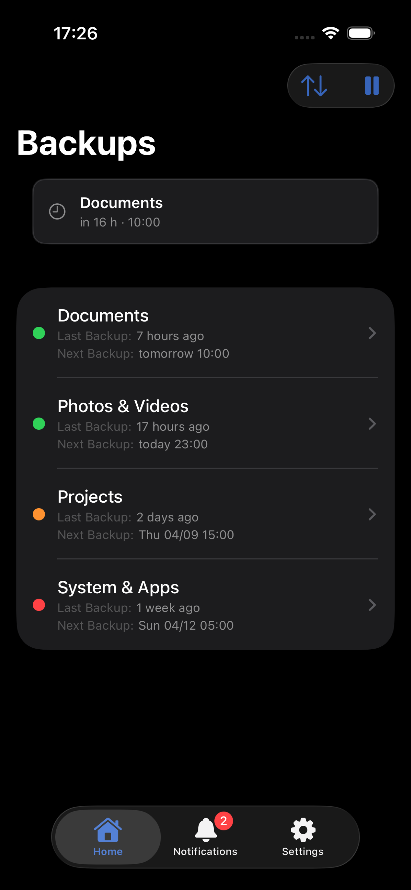
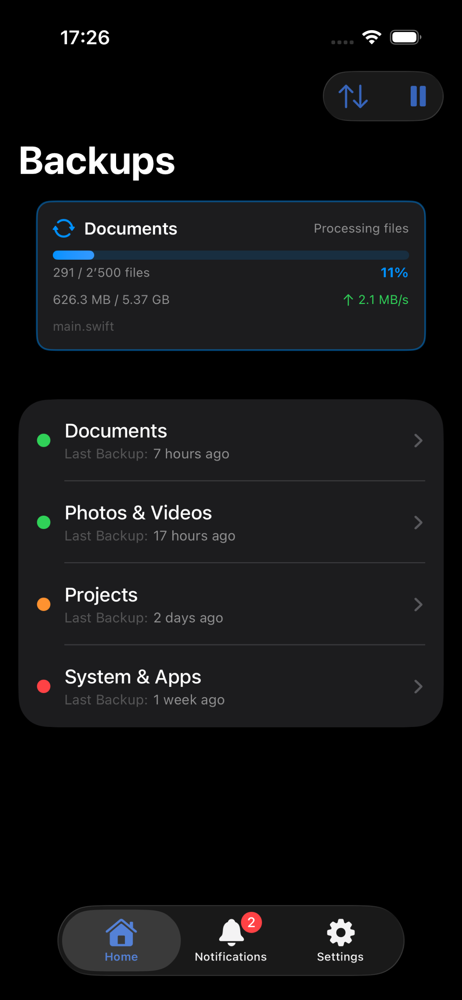
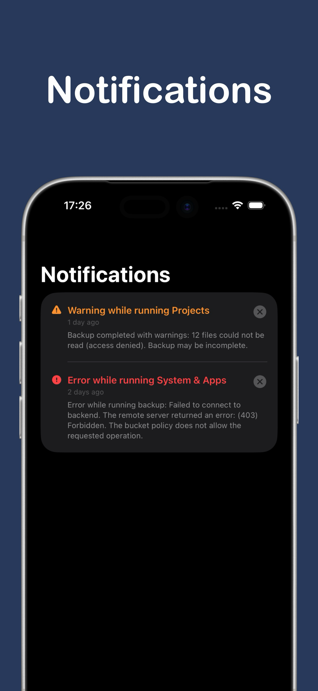
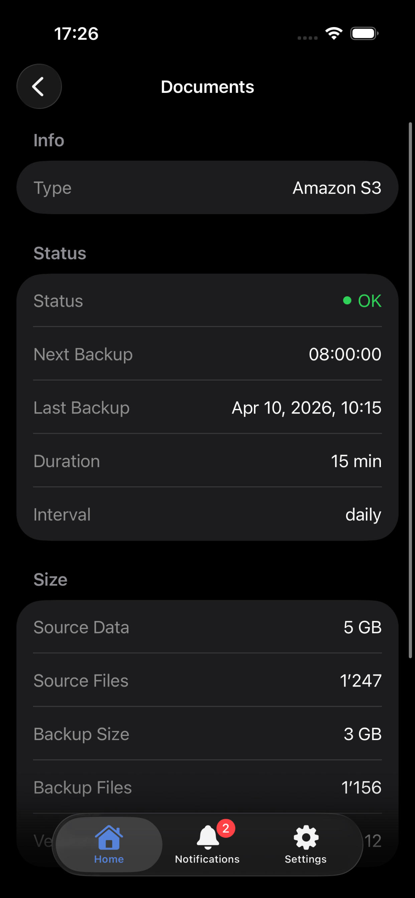
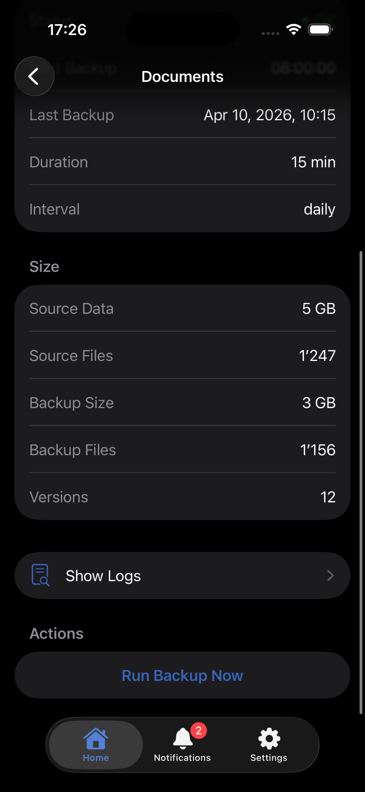
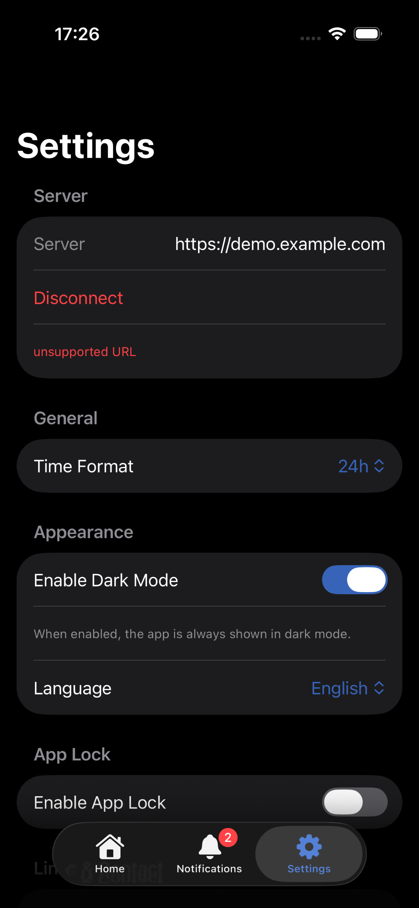

  

A native iOS app to monitor your Duplicati backups on the go.

https://testflight.apple.com/join/HagdJKad

---

## What it does

Duplicati is a solid backup tool – but checking your backup status means opening a browser, navigating to your instance and logging in. This app puts your backup status directly on your iPhone.

**Features:**

- Overview of all configured backups
- Status of the last backup run
- Next scheduled backup time
- Trigger a backup manually from your phone
- Notifications tab – see all server notifications in one place
- Detailed log view for each backup
- Credentials stored securely in the iOS Keychain
- Works with any self-hosted Duplicati instance

---

## Status

Actively developed. Core features are stable – feedback and feature requests welcome.

---

## About this project

I work in IT but I am not a software developer. I built this app with the help of Claude Code, an AI coding assistant. Without it, a project like this would not have been realistic for me.

Companion for Duplicati is an unofficial app and is not affiliated with or endorsed by the Duplicati developers.

---

## Contributing

Found a bug or have a feature request? Open an issue.

---

<table>
  <tr>
    <td></td>
    <td></td>
    <td></td>
  </tr>
</table>

<table>
  <tr>
    <td></td>
    <td></td>
    <td></td>
  </tr>
</table>
